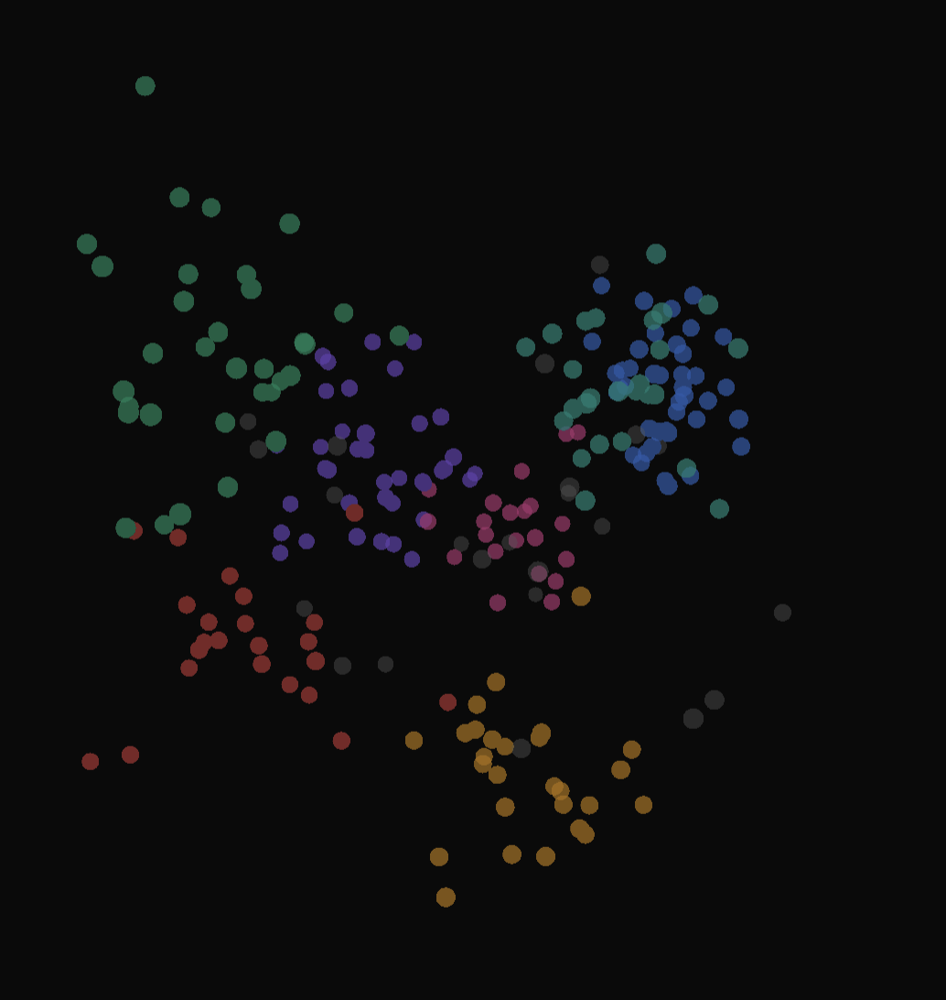

# whoami.dataviz

> *"Give me a person's browsing history and I'll tell you who they are."* — Elliot Alderson

A 3D interactive visualization of your entire codebase identity — repos mapped in vector space. Similar code clusters together. The result is a spatial answer to the question every developer asks: *who am I, really, as an engineer?*



## The Novel Part

**Dual embeddings** — most tools use one embedding strategy. This uses two:

1. **Semantic (StarEncoder)** — *what* the code does: "fraud detection pipeline", "React dashboard"
2. **Structural (tree-sitter AST)** — *how* the code is written: async patterns, test coverage, complexity

Repos cluster by both **purpose** and **style**. A PyTorch experiment and a TensorFlow experiment land near each other (same purpose), but a heavily-tested production ML system sits apart (different style).

## Demo

- **Rotate:** drag
- **Zoom:** scroll
- **Pan:** shift+drag
- **Search:** type to highlight
- **Toggle:** switch between UMAP and t-SNE projections

## Architecture

```
S3 (your repos)
    │
    ▼
Dual Embedder
├── StarEncoder (768-dim semantic)
└── Tree-sitter (8-dim structural)
    │
    ▼
Combined Vector (776-dim)
    │
    ▼
HDBSCAN Clustering
    │
    ▼
Claude API (cluster naming)
    │
    ▼
UMAP + t-SNE → 3D
    │
    ▼
Deck.gl Point Cloud
```

## Structural Features

Tree-sitter extracts 8 features per repo:

| Feature | Signal |
|---------|--------|
| Function count | Size/complexity |
| Max nesting depth | Code complexity |
| Async usage ratio | Architectural pattern |
| Import count | Coupling |
| Test file ratio | Engineering maturity |
| Cyclomatic complexity | Actual complexity |
| Language mix | Polyglot indicator |
| Entry point pattern | Repo type (CLI, lib, app) |

## Quick Start

```bash
# Install dependencies
pip install -r pipeline/requirements.txt

# Option 1: Generate synthetic demo data
python -m pipeline.synthetic --output coords.json --repos 250

# Option 2: Run on your real repos (requires S3 + HuggingFace auth)
python -m pipeline.main

# Start the server
pip install -r api/requirements.txt
uvicorn api.main:app --port 8000

# Open http://localhost:8000
```

## Stack

| Layer | Choice |
|-------|--------|
| Semantic embedding | StarEncoder |
| Structural embedding | tree-sitter (Python, JS, TS, Go, Java, Rust) |
| Clustering | HDBSCAN |
| Cluster naming | Claude API |
| Dimension reduction | UMAP + t-SNE |
| Frontend | Vanilla JS + Deck.gl PointCloudLayer |
| API | FastAPI |
| Deployment | Docker / ECS Fargate |

## Privacy

The public demo uses **synthetic data**. The pipeline code is open source — run it on your own repos locally. Your real codebase never leaves your machine.

## Project Structure

```
whoami-dataviz/
├── pipeline/           # Embedding + clustering pipeline
│   ├── embedder.py     # StarEncoder semantic embeddings
│   ├── ast_features.py # Tree-sitter structural features
│   ├── clusterer.py    # HDBSCAN
│   ├── reducer.py      # UMAP + t-SNE
│   ├── labeler.py      # Claude API cluster naming
│   ├── synthetic.py    # Demo data generator
│   └── main.py         # Pipeline orchestrator
├── api/                # FastAPI server
├── frontend/           # Deck.gl visualization
├── docker/             # Containerization
└── coords.json         # Generated 3D coordinates
```

## License

MIT
